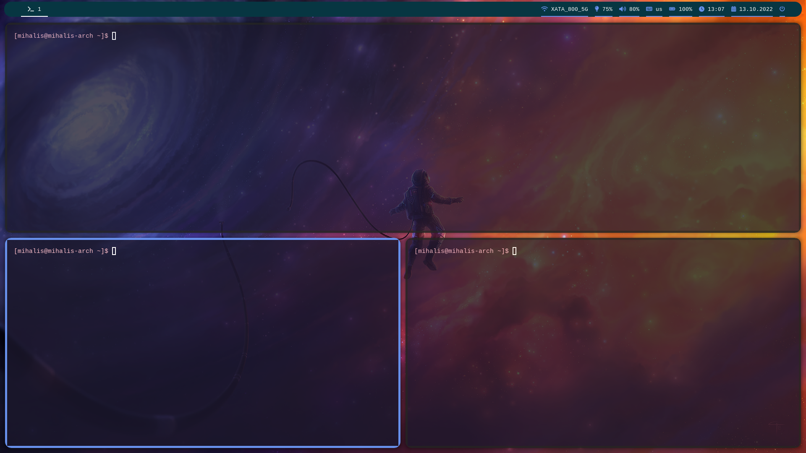

<div align="center">

# Установка Arch Linux
https://gist.github.com/fjpalacios/441f2f6d27f25ee238b9bfcb068865db

<br>

# Скриншот


# Установка для Arch Linux
</div>

## Установка Xserver
```
sudo pacman -S xorg-server xorg-apps xorg-xinit
```

## Установка i3-gaps
```
sudo pacman -S i3-gaps polybar rofi
```

### Установка терминала, файлового менеджера, менеджера обоев, менеджера анимаций, менеджера скриншотов, шрифта с поддержкой иконок (соответсвенно)
```
sudo pacman -S alacritty thunar nitrogen picom gnome-screenshot ttf-font-awesome
```
В этом репо, в конфиге nitrogen, установлена пака для обоев по пути ~/Pictures/wallpapers/ и картинка для рабочего стола - space.jpg (см. папку wallpapers в этом репо), поэтому переместим ее в соответсвующую директорию:
```
sudo cp ./wallpapers/space.jpg ~/Pictures/wallpapers/
```

Для своей настройки вводи в терминал ```nitrogen``` для gui редактора

## Установка PulseAudio
```
sudo pacman -S pulseaudio pulseaudio-alsa
```

## Установка paru (для гугла и не только)
```
sudo pacman -S --needed base-devel git
```
```
git clone https://aur.archlinux.org/paru.git
```
```
cd paru
```
```
makepkg -si
```

## Установка полезного ПО
```
paru -S google-chrome sublime-text-3
```

Символическая ссылка, чтобы открывать sublime через консоль, например subl /etc/hosts
```
sudo ln -s /opt/sublime_text_3/sublime_text /usr/local/bin/subl
```

## Установка обоев для lightdm (если установелн)
```
paru -S lightdm-gtk-greeter-settings
```
```
sudo subl /etc/lightdm/lightdm-gtk-greeter.conf
```
В конце файла находим блок ```[greeter]``` и вместо ```#background=``` пишем ```background=/usr/share/pixmaps/space.jpg```.
Теперь скопируйте обои в директорию ```/usr/share/pixmaps/```:
```
sudo cp ./wallpapers/space.jpg /usr/share/pixmaps/
```

## Изменение яркости
По умолчанию, Linux ограничивает возможность изменения яркости. Чтобы это обойти, необходимо добавить пользователя в группу ```video```:
```
sudo usermod -a -G video you_username
```
И добавить правило: 
```
sudo echo ACTION=="add", SUBSYSTEM=="backlight", RUN+="/bin/chgrp video $sys$devpath/brightness", RUN+="/bin/chmod g+w $sys$devpath/brightness" >> /etc/udev/rules.d/backlight.rules
```

## Копирование конфигов
```
git clone https://github.com/MihailMuh/i3-gaps-config.git
```
```
cd i3-gaps-config
```
```
cp -r ./config/* ~/.config
```

## Перезагрузка обязательна
```
sudo reboot
```
